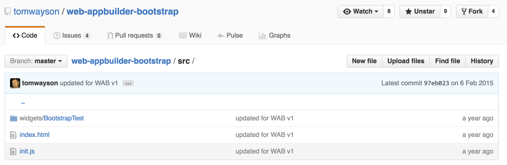
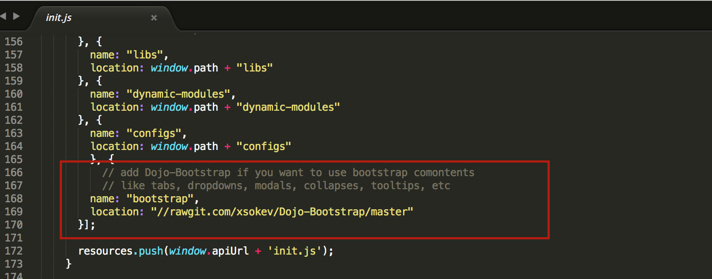
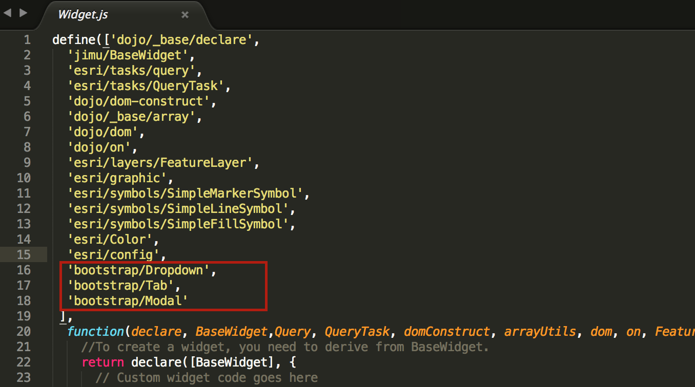
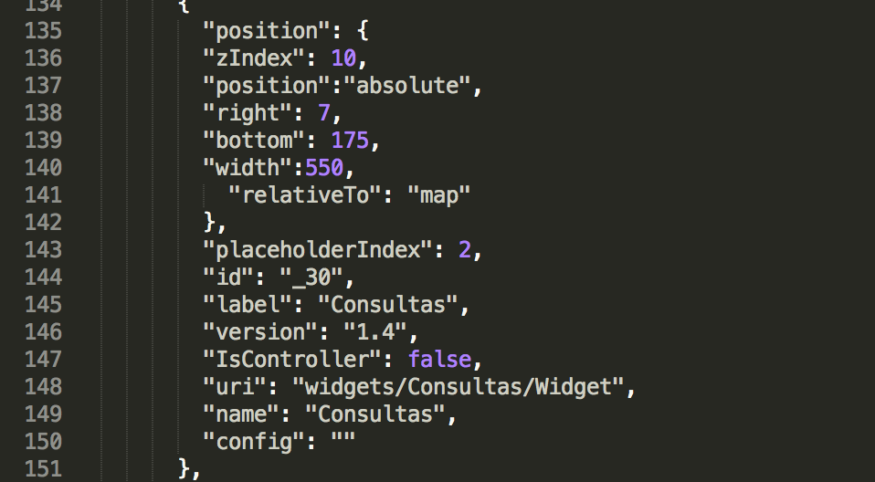
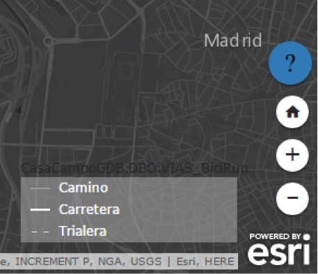
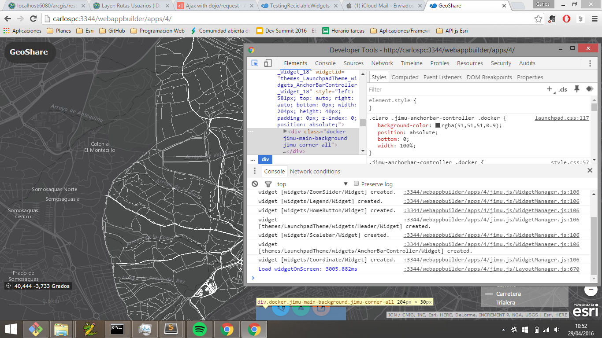
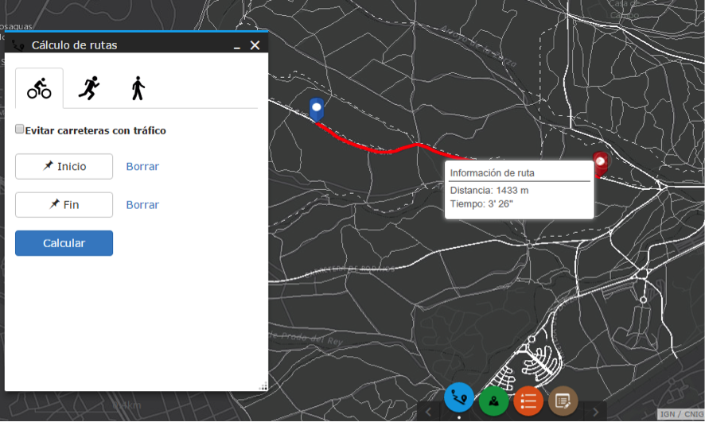
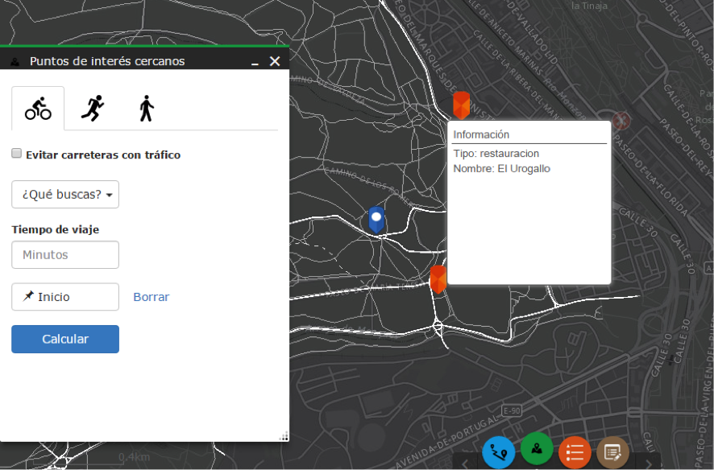
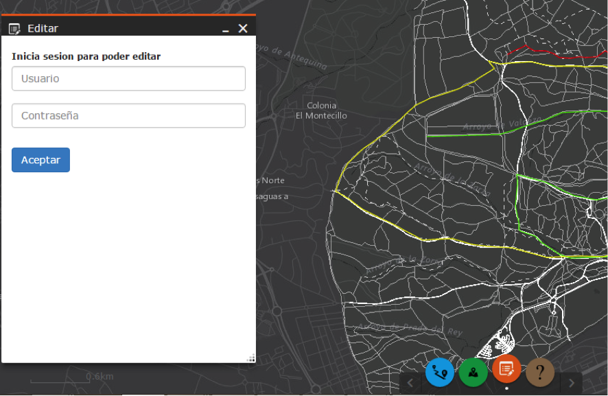
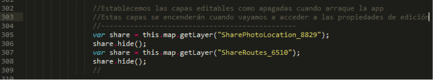

<!-- .slide: class="title" -->

## GeoShare
Proyecto Final de Master de Esri 2016

[https://github.com/Jimeno0/PFM-GeoShare/](https://github.com/Jimeno0/PFM-GeoShare/)

---

<!-- .slide: class="section" -->

## Introducción a la App

[](https://www.youtube.com/watch?v=Hzyg60Gfl-M "Everything Is AWESOME")

---

<!-- .slide: class="section" -->

## Material empleado

* ArcMap 10.3
	* Desarrollo del proyecto y tratamiento de datos
* PyScripter
	* Geoprocesamientos
* SQL Server
	* Gestionar permisos en la BBDD Enterprise
* ArcGIS Server Manager
	* Publicación de servicios
* ArcGIS Online
	* Creación de los Web Maps
	*Publicación de servicios
* Web AppBuilder for developers & Sublime Text 3
	* Creación de la aplicación web

---

<!-- .slide: class="section" -->


##Datos de partida

* Open Street Map

	* http://download.geofabrik.de/europe/spain.html

	* Pluggin para ArcMap: https://www.arcgis.com/home/item.html?id=75716d933f1c40a784243198e0dc11a1

* MDT
	
	* http://centrodedescargas.cnig.es/CentroDescargas/buscadorCatalogo.do?codFamilia=02107

---

<!-- .slide: class="section" data-transition="fade"-->

##Tratamiento de datos previos a la realización del Network

* Población de la red
* Correcciones topológicas
* Cálculo de los desniveles por tramo
* Cálculo del tiempo por tramo en bici
* Creación de la feature class de los puntos de interés

--


---

<!-- .slide: class="section" -->


##Creacion del Network

---

##Geoprocesamientos

---

##Arquitectura y versionado

---

##Publicación de los servicios

---

#Desarrollo de la app

---

##Objetivos

* Aplicación sencilla
* Fácil de usar
* Diseño atractivo

---

##Integración de Bootstrap en Web AppBuilder


https://github.com/tomwayson/web-appbuilder-bootstrap



--

###Archivos necesarios

* index.html
* init.js



--

###Requires




---

##Simplificación de la app

>* A través del config.json
	* Eliminación de widgets que no utilizamos
	* Ubicación de los widgets y personalización
	

--




--

##Otras ediciones de la App

>Para hacer cualquier cambio de la aplicación podemos identificar el elemento a traves de la consola de google chrome y luego viendo donde se encuentra el elemento aplicarle los cambios que consideremos necesarios



---

#Widgets

##Objetivo apliciación social

* Dieño:
	* Sencillo
	* Intuitivo
	* Atractivo

---

##Widgets de geoprocesamiento

* Cálculo de rutas
* Busqeda de puntos de interés cercanos

--

###Cálculo de rutas



--

###Parámetros de entrada:

* Modo de viaje
* Punto de inicio
* Punto de destino

--


###HTML

* Tabs:

```HTML
	<ul class="nav nav-tabs" role="tablist">
		<li class="nav-item active">
	 		<a class="nav-link" 
	 		data-dojo-attach-event="onclick:funcionParamBici" href="#bici" 
	    	role="tab" data-toggle="tab">
	    		
	    	</a>
	    </li>
	    ....   
```
* Tab-panel:


```HTML
    <div class="tab-content">
      <div class="tab-pane active" id="bici" role="tabpanel">
      <br>
        <label>
          <input type="checkbox" data-dojo-attach-point="trafficRadio" unchecked>
            Evitar carreteras con tráfico
          </label>
      </div>
      ....
```

--

###HTML

####Botones:

* Inicio & final

```HTML
<div id=inicioDiv>
	<button type="button" class="btn btn-default" data-dojo-attach-event="onclick:funcionCapaInicio">
    	<span class="glyphicon glyphicon-pushpin" aria-hidden="true"></span>
    	Inicio
    </button>
    <button type="button" class="btn btn-link" data-dojo-attach-event="onclick:funcionBorrar">
    	Borrar
    </button>
</div>
  ....
```
* Calcular

```HTML
    <div id= calculoDiv>
          <button type="button" class="btn btn-primary" data-dojo-attach-event="onclick:funcionCalcular">
            Calcular
          </button>
    </div>
```

--

###JAVASCRIPT

Ciclo de vida del widget

```javascript

	postCreate: function() {
	},
	startup: function() {
	},
	onOpen: function() {
	},
	onClose: function() {
	}
```

--

###JAVASCRIPT

Startup: Creamos capas gráficas y simbologías

```javascript
   	startup: function() {
	      this.inherited(arguments);
	      this.graphicPuntos = new GraphicsLayer();
	      this.map.addLayer(this.graphicLineas);
	      this.pInicioSymbol = new PictureMarkerSymbol('http://esri.github.io/quickstart-map-js/images/blue-pin.png',20,35);
	      this.pInicioSymbol.yoffset = 17;

	      ...
    	},

```

--

###JAVASCRIPT

onOpem: Infowindow y funcion para pintar los puntos

```javascript
	
	onOpen: function(){
        var infoWindow = new InfoWindowLite(null, domConstruct.create("div", null, null, this.map.root));
        infoWindow.startup();
        this.map.setInfoWindow(infoWindow);
        this.map.infoWindow.resize(200, 80);

        this.DrawPoints = this.map.on("click",lang.hitch(this,clickPuntos));

		function clickPuntos(e){
			if (this.tipoPunto == "puntoIni") {
	            puntoInicio = e.mapPoint;
	            var inicioGraphic = new Graphic(puntoInicio,this.pInicioSymbol);
	            this.graphicPuntos.add(inicioGraphic);
	            var feature1 = [];
	            feature1.push(inicioGraphic);
	            featureSetInicio = new FeatureSet();
	            featureSetInicio.features = feature1; 

	            ...
		};
          this.DrawPoints;
     },

```

--

###JAVASCRIPT

onCLose: Evitamos que pinte elemento y limpiamos las capas gráficas

```javascript
	onClose: function(){
        this.tipoPunto = null;
        this.graphicPuntos.clear();
        this.graphicPuntoFin.clear();
        this.graphicLineas.clear();
    },

```

--

###JAVASCRIPT

Funciones definidas:
 * Función que define los parámetros del tipo de rta
 * Función que define los parámetros del tipo de punto dibujado
 * Función para borrar los puntos dibujados

```javascript
	funcionParamBici:function(){
        this.tipoRutaParam = "Bicicleta";
    },
    ...
    funcionParamRun:function(){
        this.trafficRadio.checked = false;
        this.tipoRutaParam = "Run";
    },
    funcionCapaInicio:function(){
        this.tipoPunto = "puntoIni";
    },
    ...
    funcionBorrar:function(){
        this.inherited(arguments);
        this.graphicPuntos.clear();
    },

```

--

###JAVASCRIPT

Funciones definidas:
 * Fución para el cálculo de la ruta

```javascript
	this.tipoPunto = null;
    this.graphicLineas.clear();
    ...
    var radio = this.trafficRadio.checked;
	if (radio == true) {
	    this.tipoRutaParam = "BiciSinTrafico";
	};
	var inputParameters = {
        "TipoRuta": this.tipoRutaParam,
        "PuntoInicio": featureSetInicio,
        "PuntoDestino": featureSetFin
	};
	var GProutesUrl = "http://localhost:6080/arcgis/rest/services/Proyecto/CalculoRutas7/GPServer/Calculo%20de%20rutas";
	var gp = new Geoprocessor(GProutesUrl);
	gp.setOutSpatialReference( {wkid: 102100});
	gp.submitJob(inputParameters,callBack);

```

--

###JAVASCRIPT

Funciones definidas:
 * Fución para el cálculo de la ruta

```javascript
    function callBack(results){ 
		gp.getResultData(results.jobId,"Ruta",resultsCallback);
		function resultsCallback(featureRuta){
	        ruta = featureRuta.value.features[0];
	        var sls = new SimpleLineSymbol(SimpleLineSymbol.STYLE_SOLID,new Color([255,0,0]),4);
	        mapa.setExtent(ruta.geometry.getExtent());
	        var rutaGraphic = new Graphic(ruta.geometry,sls,ruta.attributes,infoTemplate);
	        graphicLineas.add(rutaGraphic);                                     
		};
	};

```

--

###JAVASCRIPT

Funciones definidas:
 * Fución para el cálculo de la ruta

```javascript
    infoTemplate = new InfoTemplate();
	infoTemplate.setTitle("<strong>Información de ruta</strong>");
	infoTemplate.setContent("hello");
	infoTemplate.setContent(getTextContent);
    function getTextContent(graphic){

	    if (graphic.attributes.Total_SegundosBici != undefined) {
	      var totalSegundos = graphic.attributes.Total_SegundosBici;
	    }else if (graphic.attributes.Total_SegundosRun != undefined) {
	      var totalSegundos = graphic.attributes.Total_SegundosRun;
	    }else if (graphic.attributes.Total_SegundosAndando != undefined) {
	      var totalSegundos = graphic.attributes.Total_SegundosAndando;
	    };
	    var longitud = Math.round(graphic.attributes.Total_Length);
	    var minutosDecimales = totalSegundos/60;
	    var minutos = parseInt(minutosDecimales);
	    var segundos = Math.round((minutosDecimales - minutos)*60); 

	    return "<b>Distancia:</b> " + longitud + " m <br><b>Tiempo:</b> " + minutos + "'  " + segundos + "''";
    };

```

--

###Búsqueda de puntos de interés cercanos



--

###Parámetros de entrada:

* Modo de viaje
* Tipo de Puntos de interés
* Tiempo de viaje
* Ubicación

---

##Widget de edición



--

##Objetivo:

* Tener todo en al misma app
* Restringir acceso solo a usuarios registrados

--

##Todo en la misma app

>* ###Problema:
	 Para poder utilizar el widget de edición necesario tener las capas editables en el Web map del que embebe. Si se viesen todas las rutas de los usuarios en el mapa sería confuso.

>* ###Solución:
	 Apagar las capas editables a menos que se abra el widget de edición.

--

##Todo en la misma app

* Apagar las capas editables de inicio

jimu.js --> MapManager.js



* Mostrar capas editables

	>* Funcion onOpen .show()
	>* Funcion onCLose .hide()

--

##Restringir acceso solo a usuarios registrados

###html

```html
<div id="edit"style="width:100%; height:100%; min-width:280px;min-width:240px;">
    <div id="usuarioYpassDiv">
          <label for="usuarioInput">Inicia sesion para poder editar</label>
          <input id='usuarioInput' type="text"class = "form-control" placeholder="Usuario">
          <br>
          <input id='pssInput' type="text"class = "form-control" placeholder="Contraseña">
          <p id="wrongPass"></p>
          <br>
          <button type="button" class="btn btn-primary" data-dojo-attach-event="onclick:funcionLogearse">Aceptar</button>
    </div>
```

--

##Restringir acceso solo a usuarios registrados

###javascript

```javascript

	funcionLogearse:function(){
      this.inherited(arguments);
      this.userPass = ["Carlos","1234"],["Juli","123"]];
      var usuario = usuarioInput.value;
      var pass = pssInput.value;
        for (var i = 0; i < this.userPass.length; i++) {
          if (this.userPass[i][0] == usuario && this.userPass[i][1] == pass) {
            document.getElementById("usuarioYpassDiv").style.display = "none";
          }else{
            document.getElementById("wrongPass").innerHTML = ("Nombre de usuario o contraseña incorrectos");
          };
        };
    },


```

--


---


<!-- .slide: class="section" -->

## List
* List item
	* List sub-item

---


<!-- .slide: class="section" -->

## Code
```javascript
var pi = 3.14;
var text = 'Hello world';
```

---

<!-- .slide: class="questions centered" -->

## Questions?

Contact info

* GitHub : [Jimeno0](https://github.com/Jimeno0)
* Twitter: [Jimeno0](https://twitter.com/jimeno0)
* Linkedin: [Carlos Pérez Jimeno](https://www.linkedin.com/in/carlos-perez-jimeno-087b3390?trk=nav_responsive_tab_profile_pic)


---


<!-- .slide: class="end" -->
