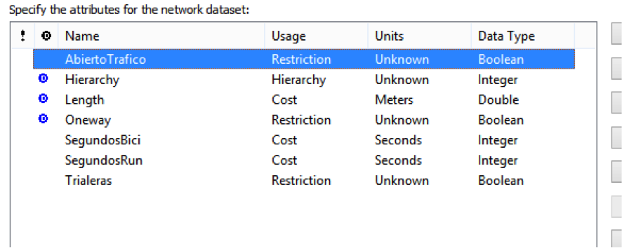
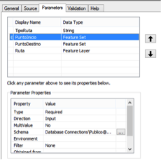
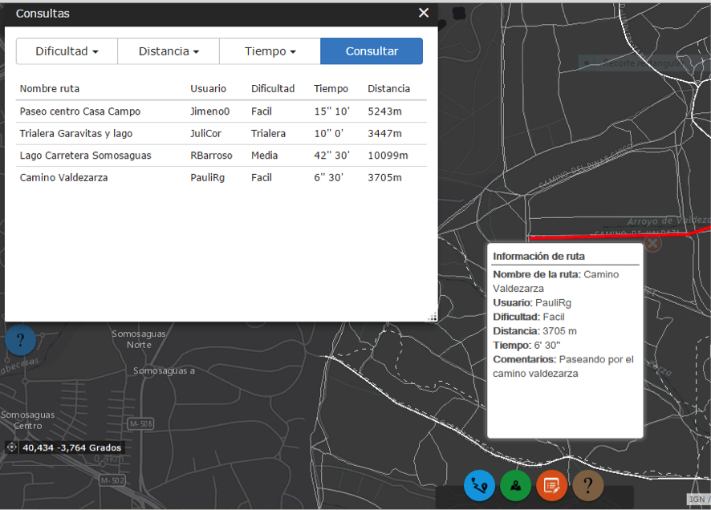
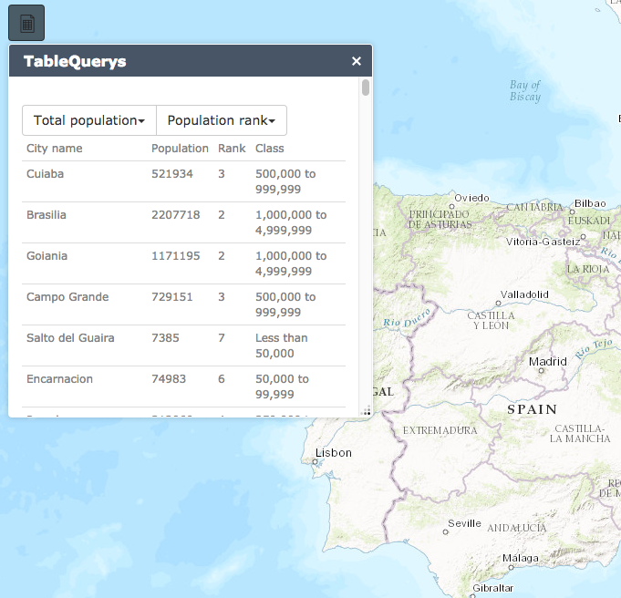
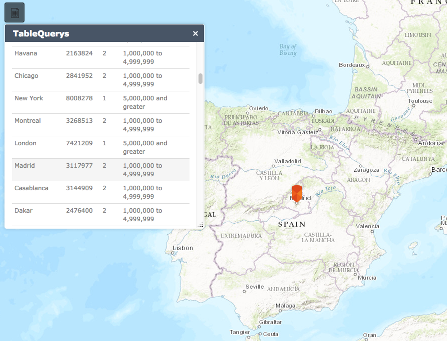
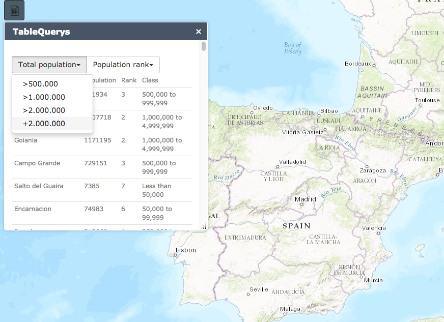
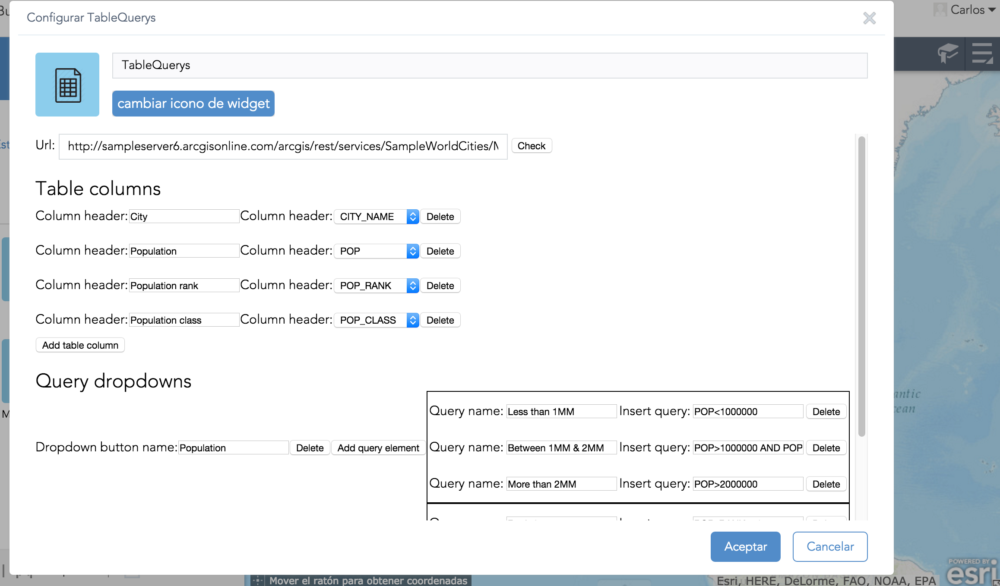

<!-- .slide: class="title" -->

## GeoShare
Proyecto Final de Master de Esri 2016

[https://github.com/Jimeno0/PFM-GeoShare/](https://github.com/Jimeno0/PFM-GeoShare/)

---

<!-- .slide: class="section" -->

## Introducción a la App

[](https://www.youtube.com/watch?v=Hzyg60Gfl-M "Everything Is AWESOME")

---

<!-- .slide: class="section" -->

## Material empleado

* ArcMap 10.3
	* Desarrollo del proyecto y tratamiento de datos
* PyScripter
	* Geoprocesamientos
* SQL Server
	* Gestionar permisos en la BBDD Enterprise
* ArcGIS Server Manager
	* Publicación de servicios
* ArcGIS Online
	* Creación de los Web Maps
	*Publicación de servicios
* Web AppBuilder for developers & Sublime Text 3
	* Creación de la aplicación web

---

<!-- .slide: class="section" -->


##Datos de partida

* Open Street Map

	* http://download.geofabrik.de/europe/spain.html

	* Pluggin para ArcMap: https://www.arcgis.com/home/item.html?id=75716d933f1c40a784243198e0dc11a1

* MDT
	
	* http://centrodedescargas.cnig.es/CentroDescargas/buscadorCatalogo.do?codFamilia=02107

---

<!-- .slide: class="section" -->

##Tratamiento de datos previos a la realización del Network

* Población de la red
	* Digitalizar tramos que faltan apunyandonos imagenes satélite
* Correcciones topológicas
	* Creación del Dataset
	* Creación de Topología dentro del dataset que nos detecte si hay puntos colgantes
* Definición de la clasificación
	* Jerearquia
	* Evitar conflictos
	* Carreteras, caminos y trialeras

--

<!-- .slide: class="section" -->

##Tratamiento de datos previos a la realización del Network

* Cálculo de los desniveles por tramo y tiempo por tramo en bici
	* Apoyandonos en el MDT asignamos coordenadas Z a los puntos final e inicial de cada tramo
	* Desnivel Zf- Zi
	* Clasificación en rangos según Desnivel
	* Asignación de Velocidad según inclinación
* Creación de la feature class de los puntos de interés
	* Descarga con la OSM tool para ArcGIS
	* Estuido POIs útiles
	* Selcción por atributos 

---

<!-- .slide: class="section" -->


##Creacion del Network

* Definimos atributos:
	* Coste
	* Restricción
	* Jerarquía 



---

<!-- .slide: class="section" -->

##Geoprocesamientos

* Scripts de python
	* Cáclulo de rutas
	* Busqueda de POIs cercanos

--

###Cálculo de rutas

* Cuatro herramientas:
	* Make route layer
	* Add locations
	* Solve
	* Copy Features
* Get parámeter/set parámeter

--

###Cálculo de rutas

* Introducir el script en una toolbox



--

###Búsqueda de POIs cercanos

* Cuatro herramientas:
	* Make route layer
	* Add locations
	* Solve
	* Make feature layer (consulta SQL tipo POIs)
	* Copy Features (Con selección por localización)
* Get parámeter/set parámeter 

---

<!-- .slide: class="section" -->

##Arquitectura y versionado

* BBDD Corporativa
	* Create Enterprise GDB
	* Versionado: Controlar ediciones
		* Versión default: Controla Ediciones
		* Versión Publica: Sobre la que se publicará el servicio
	* SQL Server Manager
		* Crear Usuario con permisos de edicioón
		* Conectado a la versión pública

---

<!-- .slide: class="section" -->

##Publicación de los servicios

* ArcGIS Server
* Desde la conexión Pública
* Capas editables publicadas como Feature Service
* Capas de información como Map Service
* Herramientas de geoprocesos publicados como GPService
	* Desde la ventana de resultados

---

<!-- .slide: class="section" -->

#Desarrollo de la app

---

<!-- .slide: class="section" -->

##Objetivos

* Aplicación sencilla
* Fácil de usar
* Diseño atractivo

---

<!-- .slide: class="section" -->

##Integración de Bootstrap en Web AppBuilder


https://github.com/tomwayson/web-appbuilder-bootstrap


--

###Archivos necesarios

* index.html
* init.js


--

###Requires


---

<!-- .slide: class="section" -->

##Simplificación de la app

>* A través del config.json
	* Eliminación de widgets que no utilizamos
	* Ubicación de los widgets y personalización
	

--


--

##Otras ediciones de la App

>Para hacer cualquier cambio de la aplicación podemos identificar el elemento a traves de la consola de google chrome y luego viendo donde se encuentra el elemento aplicarle los cambios que consideremos necesarios


---

<!-- .slide: class="section" -->

#Widgets

##Objetivo apliciación social

* Dieño:
	* Sencillo
	* Intuitivo
	* Atractivo

---

<!-- .slide: class="section" -->

##Widgets de geoprocesamiento

* Cálculo de rutas
* Busqeda de puntos de interés cercanos

--

###Cálculo de rutas


--

###Parámetros de entrada:

* Modo de viaje
* Punto de inicio
* Punto de destino

--


###HTML

* Tabs:

```HTML
	<ul class="nav nav-tabs" role="tablist">
		<li class="nav-item active">
	 		<a class="nav-link" 
	 		data-dojo-attach-event="onclick:funcionParamBici" href="#bici" 
	    	role="tab" data-toggle="tab">
	    		
	    	</a>
	    </li>
	    ....   
```

* Tab-panel:


```HTML
    <div class="tab-content">
      <div class="tab-pane active" id="bici" role="tabpanel">
      <br>
        <label>
          <input type="checkbox" data-dojo-attach-point="trafficRadio" unchecked>
            Evitar carreteras con tráfico
          </label>
      </div>
      ....
```

--

###HTML

####Botones:

* Inicio & final

```HTML
	<div id="inicioDiv">
		<button type="button" class="btn btn-default" data-dojo-attach-event="onclick:funcionCapaInicio">
	    	<span class="glyphicon glyphicon-pushpin" aria-hidden="true"></span>
	    	Inicio
	    </button>
	    <button type="button" class="btn btn-link" data-dojo-attach-event="onclick:funcionBorrar">
	    	Borrar
	    </button>
	</div>
  ....
```

* Calcular

```HTML
    <div id="calculoDiv">
          <button type="button" class="btn btn-primary" data-dojo-attach-event="onclick:funcionCalcular">
            Calcular
          </button>
    </div>
```

--

###JAVASCRIPT

Ciclo de vida del widget

```javascript

	postCreate: function() {
	},
	startup: function() {
	},
	onOpen: function() {
	},
	onClose: function() {
	}
```

--

###JAVASCRIPT

Startup: Creamos capas gráficas y simbologías

```javascript
   	startup: function() {
	      this.inherited(arguments);
	      this.graphicPuntos = new GraphicsLayer();
	      this.map.addLayer(this.graphicLineas);
	      this.pInicioSymbol = new PictureMarkerSymbol('http://esri.github.io/quickstart-map-js/images/blue-pin.png',20,35);
	      this.pInicioSymbol.yoffset = 17;

	      ...
    	},

```

--

###JAVASCRIPT

onOpem: Infowindow y funcion para pintar los puntos

```javascript
	
	onOpen: function(){
        var infoWindow = new InfoWindowLite(null, domConstruct.create("div", null, null, this.map.root));
        infoWindow.startup();
        this.map.setInfoWindow(infoWindow);
        this.map.infoWindow.resize(200, 80);

        this.DrawPoints = this.map.on("click",lang.hitch(this,clickPuntos));

		function clickPuntos(e){
			if (this.tipoPunto == "puntoIni") {
	            puntoInicio = e.mapPoint;
	            var inicioGraphic = new Graphic(puntoInicio,this.pInicioSymbol);
	            this.graphicPuntos.add(inicioGraphic);
	            var feature1 = [];
	            feature1.push(inicioGraphic);
	            featureSetInicio = new FeatureSet();
	            featureSetInicio.features = feature1; 

	            ...
		};
          this.DrawPoints;
     },

```

--

###JAVASCRIPT

onCLose: Evitamos que pinte elemento y limpiamos las capas gráficas

```javascript
	onClose: function(){
        this.tipoPunto = null;
        this.graphicPuntos.clear();
        this.graphicPuntoFin.clear();
        this.graphicLineas.clear();
    },

```

--

###JAVASCRIPT

Funciones definidas:
 * Función que define los parámetros del tipo de rta
 * Función que define los parámetros del tipo de punto dibujado
 * Función para borrar los puntos dibujados

```javascript
	funcionParamBici:function(){
        this.tipoRutaParam = "Bicicleta";
    },
    ...
    funcionParamRun:function(){
        this.trafficRadio.checked = false;
        this.tipoRutaParam = "Run";
    },
    funcionCapaInicio:function(){
        this.tipoPunto = "puntoIni";
    },
    ...
    funcionBorrar:function(){
        this.inherited(arguments);
        this.graphicPuntos.clear();
    },

```

--

###JAVASCRIPT

Funciones definidas:
 * Fución para el cálculo de la ruta

```javascript
	this.tipoPunto = null;
    this.graphicLineas.clear();
    ...
    var radio = this.trafficRadio.checked;
	if (radio == true) {
	    this.tipoRutaParam = "BiciSinTrafico";
	};
	var inputParameters = {
        "TipoRuta": this.tipoRutaParam,
        "PuntoInicio": featureSetInicio,
        "PuntoDestino": featureSetFin
	};
	var GProutesUrl = "http://localhost:6080/arcgis/rest/services/Proyecto/CalculoRutas7/GPServer/Calculo%20de%20rutas";
	var gp = new Geoprocessor(GProutesUrl);
	gp.setOutSpatialReference( {wkid: 102100});
	gp.submitJob(inputParameters,callBack);

```

--

###JAVASCRIPT

Funciones definidas:
 * Fución para el cálculo de la ruta

```javascript
    function callBack(results){ 
		gp.getResultData(results.jobId,"Ruta",resultsCallback);
		function resultsCallback(featureRuta){
	        ruta = featureRuta.value.features[0];
	        var sls = new SimpleLineSymbol(SimpleLineSymbol.STYLE_SOLID,new Color([255,0,0]),4);
	        mapa.setExtent(ruta.geometry.getExtent());
	        var rutaGraphic = new Graphic(ruta.geometry,sls,ruta.attributes,infoTemplate);
	        graphicLineas.add(rutaGraphic);                                     
		};
	};

```

--

###JAVASCRIPT

Funciones definidas:
 * Fución para el cálculo de la ruta

```javascript
    infoTemplate = new InfoTemplate();
	infoTemplate.setTitle("<strong>Información de ruta</strong>");
	infoTemplate.setContent("hello");
	infoTemplate.setContent(getTextContent);
    function getTextContent(graphic){

	    if (graphic.attributes.Total_SegundosBici != undefined) {
	      var totalSegundos = graphic.attributes.Total_SegundosBici;
	    }else if (graphic.attributes.Total_SegundosRun != undefined) {
	      var totalSegundos = graphic.attributes.Total_SegundosRun;
	    }else if (graphic.attributes.Total_SegundosAndando != undefined) {
	      var totalSegundos = graphic.attributes.Total_SegundosAndando;
	    };
	    var longitud = Math.round(graphic.attributes.Total_Length);
	    var minutosDecimales = totalSegundos/60;
	    var minutos = parseInt(minutosDecimales);
	    var segundos = Math.round((minutosDecimales - minutos)*60); 

	    return "<b>Distancia:</b> " + longitud + " m <br><b>Tiempo:</b> " + minutos + "'  " + segundos + "''";
    };

```

--

###Búsqueda de puntos de interés cercanos


--

###Parámetros de entrada:

* Modo de viaje
* Tipo de Puntos de interés
* Tiempo de viaje
* Ubicación

---

<!-- .slide: class="section" -->

##Widget de edición


--

##Objetivo:

* Tener todo en al misma app
* Restringir acceso solo a usuarios registrados

--

##Todo en la misma app

>* ###Problema:
	 Para poder utilizar el widget de edición necesario tener las capas editables en el Web map del que embebe. Si se viesen todas las rutas de los usuarios en el mapa sería confuso.

>* ###Solución:
	 Apagar las capas editables a menos que se abra el widget de edición.

--

##Todo en la misma app

* Apagar las capas editables de inicio

jimu.js --> MapManager.js


* Mostrar capas editables

	>* Funcion onOpen .show()
	>* Funcion onCLose .hide()

--

##Restringir acceso solo a usuarios registrados

###html

```html
<div id="edit"style="width:100%; height:100%; min-width:280px;min-width:240px;">
    <div id="usuarioYpassDiv">
          <label for="usuarioInput">Inicia sesion para poder editar</label>
          <input id='usuarioInput' type="text"class = "form-control" placeholder="Usuario">
          <br>
          <input id='pssInput' type="text"class = "form-control" placeholder="Contraseña">
          <p id="wrongPass"></p>
          <br>
          <button type="button" class="btn btn-primary" data-dojo-attach-event="onclick:funcionLogearse">Aceptar</button>
    </div>
```

--

##Restringir acceso solo a usuarios registrados

###javascript

```javascript

	funcionLogearse:function(){
      this.inherited(arguments);
      this.userPass = ["Carlos","1234"],["Juli","123"]];
      var usuario = usuarioInput.value;
      var pass = pssInput.value;
        for (var i = 0; i < this.userPass.length; i++) {
          if (this.userPass[i][0] == usuario && this.userPass[i][1] == pass) {
            document.getElementById("usuarioYpassDiv").style.display = "none";
          }else{
            document.getElementById("wrongPass").innerHTML = ("Nombre de usuario o contraseña incorrectos");
          };
        };
    },


```

---

<!-- .slide: class="section" -->

##Widget de leyenda


--

###Widget de leyenda

* off-panel
	* Tres clasificaciones
	* Sinplificar botones

--

###manifest.json

```json
  "properties": {
  "inPanel": false
  }

```

--

###css

```css

.esriLegendLayer{
  color: white;
  font-size: 12px;
  background-color: rgba(180, 180, 180, 0.6);
}

```

---

<!-- .slide: class="section" -->

##Widget de consultas

[Demo](http://jimeno0.github.io/TableQueryWidget/TableQueryWidgetApp/index.html)




--

##Widget de consultas

* Código del widget: On open

	

--

##Widget de consultas

* Código del widget: On click

	

--

##Widget de consultas

* Código del widget: Querys dropdown menus 

	

--

##Widget de consultas

* Código del settings
	

--

###HTML widget

* Contenido dinámico
* Bootstrap

```html

<div>
  <br>
    <div id="queryBtnsDiv" class="btn-group" role="group"></div>
  <br>
  <div>
    <table  class="table table-condensed table-hover ">
      <thead  id="tableHeader">
      </thead>
      <tbody id="tableContent">
      <tbody>
    </table>
  </div>
</div>

```

--

###javaScript Widget

* Generar desplegables
* Generar cabecera y contenido de la tabla
* Consultas
* Función on click

--

###javaScript Widget

####On startup

* Botones depegables
* Cabecera de la tabla

--

```javascript
startup: function() {
        //get config variables
        tableconfigParams = this.config.inPanelVar.params.tableConfigParams;
        queyconfigParams = this.config.inPanelVar.params.queryConfigParams;
        //Set table headers
        var header = document.getElementById("tableHeader").insertRow(0);
        for (i = 0; i < tableconfigParams.length; i++) {
          var contenidoCabecera = tableconfigParams[i].header;
          var newCell = header.insertCell(i);
          newCell.innerHTML = contenidoCabecera;
        };
        //Set query dropdown menus
        for (i = 0; i < queyconfigParams.length; i++) {
          var btnName = queyconfigParams[i].buttonName;
          var dropDiv = domConstruct.create("div", {
            'class':"dropdown btn-group"
            }, "queryBtnsDiv");
          var queryBtn = domConstruct.create("button", {
            class:"btn btn-default dropdown-toggle",
            'innerHTML':btnName,
            'data-toggle':"dropdown",
            'aria-haspopup':"true",
            'aria-expanded':"false"
              }, dropDiv);
          var spanBtn = domConstruct.create("span", {class:"caret"}, queryBtn);
          var ulBtn = domConstruct.create("ul", {class:"dropdown-menu"}, dropDiv);
          for (n = 0; n < queyconfigParams[i].liParamsArray.length; n++) {
            var liName = queyconfigParams[i].liParamsArray[n].liName;
            var liQuery = queyconfigParams[i].liParamsArray[n].query;
            var liBtn = domConstruct.create("li", {}, ulBtn);
            var aLiBtn = domConstruct.create("a", {
              'innerHTML':liName,
              'onClick' : "funcionQuery('" + liQuery + "');"
              }, liBtn);
            };
          };
      },


```

--

###javaScript Widget

####On open

* contenido de la tabla
* Función Consultas
* Función on click

--

###javaScript Widget

Contenido de la tabla 

```javascript

function addColumns(fsResult){
  var features = fsResult.features;
  //
  arrayUtils.forEach(features, function(feature){
    if (feature.attributes["OBJECTID"]) {
      var targetId = "OBJECTID="+feature.attributes["OBJECTID"];

    } else if (feature.attributes["objectid"]) {
      var targetId = "objectid="+feature.attributes["objectid"]
    };
    var featureRow = domConstruct.create("tr", {'onClick' : "funciOnClick('" + targetId + "');"}, "tableContent");
    for (i = 0; i < tableconfigParams.length; i++) {
      var attName = tableconfigParams[i].fieldName;
      var contenidoRow = feature.attributes[attName];

      var newCell = featureRow.insertCell(i);
      newCell.innerHTML = contenidoRow;
    };
  });
};

```

--

###javaScript Widget

Función de las consultas

```javascript

	function funcionQuery2(e){
	  var node = document.getElementById('tableContent');
	  while (node.hasChildNodes()) {
	    node.removeChild(node.firstChild);
	  };
	  var query = new Query();
	  query.where = e;
	  query.outFields = OutFieldsArray;
	  query.returnGeometry = true;
	  var queryTask = new QueryTask(serviceUrl);
	  queryTask.execute(query,addColumns2);
	};

```

--

###javaScript Widget

Función de las consultas

```javascript
  function drawSelected(fs){
       
    for (i = 0; i < fs.features.length; i++) {
      var  featureSelected = fs.features[i];
      if (featureSelected.geometry.type == "point" ||featureSelected.geometry.type == "multiPoint") {
        var simbologia = new SimpleMarkerSymbol(SimpleMarkerSymbol.STYLE_SQUARE, 10,
          new SimpleLineSymbol(SimpleLineSymbol.STYLE_SOLID,
          new Color([255,0,0]), 1),
          new Color([0,255,0,0.25])
        );
        that.map.centerAndZoom(featureSelected.geometry);
      } else if (featureSelected.geometry.type == "lineString" ||featureSelected.geometry.type == "multiLineString") {
        var simbologia = new SimpleLineSymbol(SimpleLineSymbol.STYLE_SOLID,
          new Color([255,0,0]),4
        );
        that.map.setExtent(featureSelected.geometry.getExtent());
      }else if (featureSelected.geometry.type == "polygon" ||featureSelected.geometry.type == "multiPolygon") {
        var simbologia = new SimpleFillSymbol(SimpleFillSymbol.STYLE_SOLID,
          new SimpleLineSymbol(SimpleLineSymbol.STYLE_DASHDOT,
          new Color([255,0,0]), 2),new Color([255,255,0,0.25])
        );
        that.map.setExtent(featureSelected.geometry.getExtent());
      };
      var graphicElemnts = new Graphic(featureSelected.geometry,simbologia,featureSelected.attributes);
      that.map.graphics.add(graphicElemnts);
    };
  };
```

--

###Settings del widget de consultas

* Petición Ajax con Dojo
* Crear html
* getConfig (Almacenar parámetros)
* setConfig (parámetros durante setting)

PANTALLAZOS FALTAN

--

###Petición Ajax empleando Dojo

* Añadir propiedad al widget

```html
<input
    type="text"
    data-dojo-type="dijit/form/ValidationTextBox"
    required="true"
    placeHolder="http://sampleserver6.arcgisonline.com/arcgis/rest/services/SampleWorldCities/MapServer/0"
    data-dojo-attach-point="serviceUrl"
    data-dojo-props='style:{width:"520px"}'
    value ="http://sampleserver6.arcgisonline.com/arcgis/rest/services/SampleWorldCities/MapServer/0"
/>
```

--

###Petición Ajax empleando Dojo 

* Petición

```javaScript
var urlJson = this.serviceUrl.value+"?f=json";
	request(urlJson, {
	  headers: {
	    "X-Requested-With": null
	  }
	}).then(
	  function(text){
	    var jsonObjet = JSON.parse(text);
	   that._counters.fields = jsonObjet.fields;
	   that.functAddRow();         
	  },
	  function(error){
	    console.log("An error occurred: " + error);
	  }
	);
```

--

####Creación de html dinámico con Dojo

* Inputs, labels y select

```javascript
var elementId = "id"+this._counters.counter;
var slectId = "select"+this._counters.counter;
var row = domConstruct.toDom('<tr id="'+elementId+'">\
                                <td>\
                                  Column header:\
                                </td>\
                                <td>\
                                  <input>\
                                </td>\
                                <td>\
                                  Column header:\
                                </td>\
                                <td>\
                                  <select class="selectClass">\
                                  </select>\
                                </td>\
                                <td class="btnDeleteClass">\
                                </td>\
                              </tr>');
```

--

####Creación de html dinámico con Dojo

* Inputs, labels y select

```javascript
var nl2 = query(".selectClass",row);
	for (i = 0; i < this._counters.fields.length; i++) { 
	  var fieldOption =  domConstruct.toDom("<option>\
	                                           "+this._counters.fields[i].name+"\
	                                         </option>");
	  nl2[0].appendChild(fieldOption);
	};               

```

--

####Creación de html dinámico con Dojo

* Select options

```javascript

var nl = query(".btnDeleteClass",row);
	var btnDelete =  domConstruct.toDom("<button>\
	                                       Delete\
	                                     </button>");

	on(btnDelete, "click", functDeleteRow);
	this._counters.counterQMenu++;
	document.getElementById("columnsSettings").appendChild(row);
	nl[0].appendChild(btnDelete);
```

--

####Establecer los parámetros

* getConfig

	* Parámetros del servicio
	* Parámetros de la tabla
	* Parámetros de los desplegables

--

####Parámetros de Servicio y tabla

```javascript
var options = this.config.inPanelVar.params;
    options.serviceUrl = this.serviceUrl.get("value");
    options.tableConfigParams = new Array();
    options.queryConfigParams = new Array();
    // Save header and content for each column
    for (i = 0; i < document.getElementById("columnsSettings").children.length; i++) {
      var rowParams = document.getElementById("columnsSettings").children[i];
      var rowHeaderChild = rowParams.children[1];
      var rowFieldChild = rowParams.children[3];
      var headerName = rowHeaderChild.children[0].value;
      var fieldName = rowFieldChild.children[0].value;
      tableParams[i] = {
        header:headerName,
        fieldName:fieldName
      };
    options.tableConfigParams[i] = tableParams[i];
     };
```

--

####Parámetros de menús desplegables

```javascript
for (i = 0; i < document.getElementById("querySettings").children.length; i++) {
  var rowParams = document.getElementById("querySettings").children[i];
  var rowHeaderChild = rowParams.children[1];
  var headerName = rowHeaderChild.children[0].value;
  var  queryliParams = new Array();
  //Go over the table and save each query and query label for each dropdown button
  for (n = 0; n < rowParams.children[4].children[0].children.length; n++) {
    var rowLi = rowParams.children[4].children[0].children[n];
    var rowNameli = rowLi.children[1].children[0].value;
    var rowQuery = rowLi.children[3].children[0].value;
    queryliParams[n] = {
      liName:rowNameli,
      query:rowQuery
    };
  };
  queryParams[i] = {
    buttonName:headerName,
    liParamsArray:queryliParams
  };
  options.queryConfigParams[i] = queryParams[i];
};
```

--

####setConfig

En caso de tener la configuración a medias, grandes proyectos

```javascript
setConfig: function(config) {
	this.config = config;
	var options = config.inPanelVar.params;
	// Load service URL if exisits
	if (options && options.serviceUrl) {
	    this.serviceUrl.set('value', options.serviceUrl);
	};
	return this.config;
	},
```

---


<!-- .slide: class="questions centered" -->

## Questions?

Contact info

* GitHub : [Jimeno0](https://github.com/Jimeno0)
* Linkedin: [Carlos Pérez Jimeno](https://www.linkedin.com/in/carlos-perez-jimeno-087b3390?trk=nav_responsive_tab_profile_pic)
* Twitter: [Jimeno0](https://twitter.com/jimeno0)


---


<!-- .slide: class="end" -->
