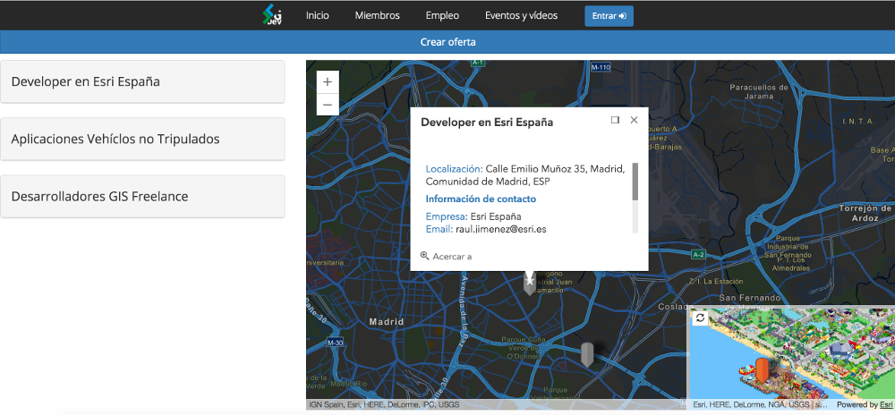
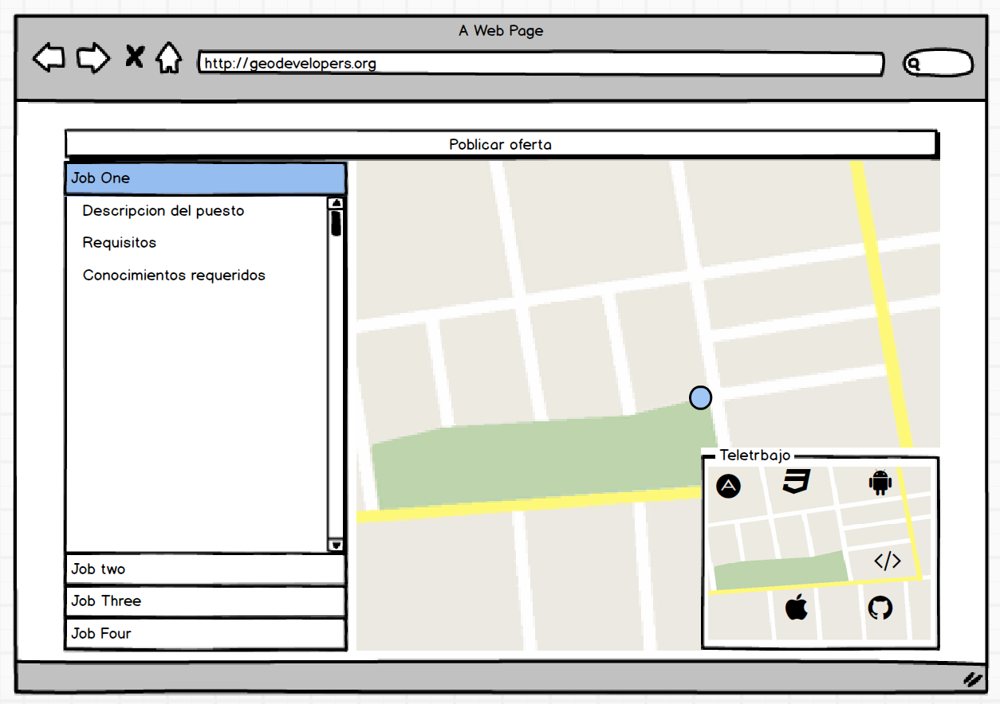
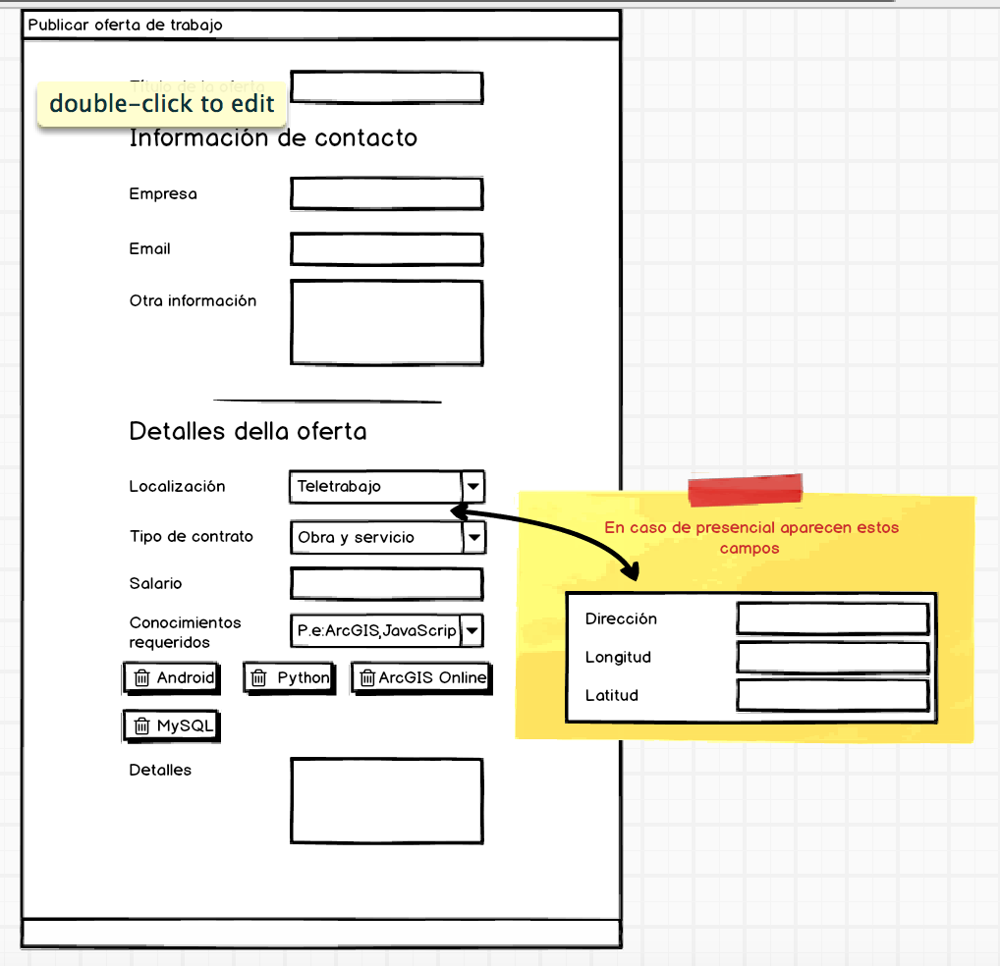

<!-- .slide: class="title" -->

## How to: Geo-Developers Jobs site

[www.geodevelopers.org/jobs/](http://www.geodevelopers.org/jobs/)

Slides : [bit.ly/geo-dev-jobs](http://bit.ly/geo-dev-jobs)

---

<!-- .slide: class="section" -->


## Carlos Pérez Jimeno


<div>
    <p>
        <a href="https://github.com/jimeno0"><i class="fa fa-github" title="GitHub"></i>/jimeno0</a><br />
        <a href="https://twitter.com/jimeno0"><i class="fa fa-twitter" title="Twitter"></i>/@jimeno0</a><br />
        <a href="https://www.linkedin.com/in/carlos-perez-jimeno-087b3390"><i class="fa fa-linkedin" title="linkedin"></i>/Carlos Pérez Jimeno</a>
    </p>
</div>


---

<!-- .slide: class="section" -->

## Introducción al site
[](http://www.geodevelopers.org/jobs/)

---

<!-- .slide: class="section" -->

## Getting started with mocks




--

<!-- .slide: class="section" -->



---

<!-- .slide: class="section" -->

##Creating webMaps 

* Diferentes metodologías con la API 4.0

```javascript

var map = new Map({
  basemap: "streets-night-vector"
});

var simpsonsMap = new WebMap({
  portalItem: {
    id: "9ac664557a774a858adee0edbb4f686c"
  }
});

var worldView = createView ("viewDiv",map,5,[-3, 40],["zoom","attribution"]);

```

--

<!-- .slide: class="section" -->

##Working with functions
  * Mejor estilo
  * Mayor eficiencia

```javascript

function createView(viewId,mapToSet,zoomToApply,centerToSet,uiArray){
  return new MapView({
  container: viewId,  
  map: mapToSet,
  zoom: zoomToApply, 
  center: centerToSet,
  ui: {
    components: uiArray 
    }
  });
}

function createSymbol (url){
...
}

```

--

<!-- .slide: class="section" -->

##Clean code

```javascript
var worldView = createView ("viewDiv",map,5,[-3, 40],["zoom","attribution"]);
var simpsonsView = createView ("miniViewDiv",simpsonsMap,6,0,["attribution"]);
var companyLocatView = createView ("viewLocDiv",companyLocatMap,5,[-3, 40]);
```

---

<!-- .slide: class="section" -->

##Working with requests

* DDBB & SimpsonsPOIs

```javascript

window.GEODEV.jobs = {};
$.getJSON("/assets/data/simpsonsPOIs.json", function(datos){
  GEODEV.jobs.simpsonsAllPOIs = datos.POIS;
  GEODEV.jobs.simpsonsPOIs = [];
  getRandomSimpsPOIs(datos.POIS);
});

$.getJSON("/api/jobs?callback=?", function(datos){
  GEODEV.jobs.data = datos;
  getRandomSimpsPOIs();

  ....

});

```

--

<!-- .slide: class="section" -->

##Getting random Simpsons POIs locations

from a json to locate remote offers

```javascript

function getRandomSimpsPOIs() {
  if (GEODEV.jobs.data && GEODEV.jobs.simpsonsAllPOIs){
    var count = 0;
    for (i = 0; i < GEODEV.jobs.data.length; i++) {
      if (GEODEV.jobs.data[i].on_remote === "yes") {
        var POIIndex = Math.floor(Math.random() * (54-count));
        GEODEV.jobs.simpsonsPOIs[count] = GEODEV.jobs.simpsonsAllPOIs[POIIndex];
        GEODEV.jobs.simpsonsAllPOIs.splice(POIIndex,1);
        count++;
      }
    }
    checkViewsThenDraw();
  }
}

```

--

<!-- .slide: class="section" -->

##Check that the views are ready

```javascript
function checkViewsThenDraw () {
  worldView.then(function(){  
    drawPoints();
  }, function(error){
    console.log("Imposible cargar el mapa:" + error);
  });
  simpsonsView.then(function(){   
    drawPoints();
  }, function(error){
    console.log("Imposible cargar el mapa:" + error);
  });
}
```

--

<!-- .slide: class="section" -->

##Then draw the locations on the map

```javascript
function drawPoints(){
  if ( worldView.ready && simpsonsView.ready) {
    var count = 0;
    for (i = 0; i < GEODEV.jobs.data.length; i++) {
      var jobID = GEODEV.jobs.data[i].id;
      ...

      var pointGraphic = new Graphic({
          attributes: {
            "id": jobID,
            ...
          }
        });

      var point = new Point();

      if (GEODEV.jobs.data[i].on_remote === "yes") {

        var POICoordX = GEODEV.jobs.simpsonsPOIs[count].geometry.x; 
        var POICoordY = GEODEV.jobs.simpsonsPOIs[count].geometry.y;
        var POIname = GEODEV.jobs.simpsonsPOIs[count].attributes.Name;
        count++;
        point.longitude = POICoordX;
        point.latitude = POICoordY;

        pointGraphic.geometry = point;
        pointGraphic.symbol = symbolSips;
        pointGraphic.attributes.location = POIname;

        if (simpsonsView.container.id === "viewDiv") {
          pointGraphic.popupTemplate = template;  
        }
        simpsonsView.graphics.add(pointGraphic);  
      }else {
        var lat = GEODEV.jobs.data[i].location_lat;
        var long = GEODEV.jobs.data[i].location_lon;

        point.longitude = long;
        point.latitude = lat;

        pointGraphic.geometry = point;
        pointGraphic.symbol = symbol;

        if (worldView.container.id === "viewDiv") {
          pointGraphic.popupTemplate = template;  
        }
        worldView.graphics.add(pointGraphic);
      }
    }
  } 
}
```

---

<!-- .slide: class="section" -->

##Change between views

```javascript
var chngViewBtn = dom.byId('chngViewBtn');
on(chngViewBtn, "click",changeViews);

function changeViews(callback){
  if (miniViewDiv.getAttribute("simpsons-in-main-view") === "0") {
    worldView = createView ("miniViewDiv",map,6,[-3, 40],["attribution"]);
    simpsonsView = createView ("viewDiv",simpsonsMap,6,0,["zoom","attribution"]);
    checkViewsThenDraw();
    miniViewDiv.setAttribute("simpsons-in-main-view","1");

  }else{
    worldView = createView ("viewDiv",map,6,[-3, 40],["zoom","attribution"]);
    simpsonsView = createView ("miniViewDiv",simpsonsMap,6,0,["attribution"]);
    checkViewsThenDraw();
    miniViewDiv.setAttribute("simpsons-in-main-view","0");
  } 
}
```

---

<!-- .slide: class="section" -->

##Job offers bootstrap accordion

* Use [jsrender](https://www.jsviews.com/)
  * `template`
  * Content
  * target

```javascript
var template = $.templates("#theTmpl");
var htmlOutput = template.render(GEODEV.jobs.data);
$("#accordion").html(htmlOutput);

```

--

<!-- .slide: class="section" -->

##Template

* `html` template inside a `<script>`
* Calling objet properties to renderize with `{{:title}}`

```javascript
<script id="theTmpl" type="text/x-jsrender">
  <div>
    <div class="panel panel-default">
      <div id="heading-{{:id}}" class="panel-heading" role="tab" >
        <h4 class="panel-title">
          <a id="link2Collapse-{{:id}}"  data-toggle="collapse" data-parent="#accordion"  href="#collapse-{{:id}}" aria-expanded="true" aria-controls="collapseOne">
            <h4>{{:title}}</h4>
          </a>
        </h4>
      </div>
      <div id="collapse-{{:id}}" job-id="{{:id}}" class="panel-collapse collapse" role="tabpanel" aria-labelledby="headingOne">
        <h5 class="text-primary" >Información de contacto</h5>
        <span class="text-primary">Empresa: </span>
        {{:company_name}}
        <br>
        <span class="text-primary">Email:  </span>
        {{:contact_email}}
        <br>
        <span class="text-primary">Otra información: </span>
        {{:contact_other}}
        <br>
        <h5 class="text-primary" >Detalles de la oferta</h5>
        <span class="text-primary">Tipo de contrato: </span>
        {{:contract_type}}
        <br>
        <span class="text-primary">Salario: </span>
        {{:salary_budget}}
        <br>
        <span class="text-primary">Detalles: </span>
        {{:offer_details}}
        <br>
        <br>
        <span class="text-primary">Localización: </span>
        {{:location}}
        <br>      
      </div>
    </div>
  </div>
</script>

```

--

<!-- .slide: class="section" -->

##Contenido

* `json` que nos devuelve la petición `Ajax` a la BBDD

```javascript
GEODEV.jobs.data = datos;

```

--

<!-- .slide: class="section" -->

##target

```javascript
$("#accordion").html(htmlOutput);
```

```html
<!-- JOBS ACCORDION -->
<div id= "jobsDiv" class="col-md-4" >
  <div id="accordion" role="tablist" aria-multiselectable="true" ></div>
</div>
```

---

<!-- .slide: class="section" -->

##GoTo & highlight selected
* Al seleccionar algun elemento del acrodeon

--

<!-- .slide: class="questions centered" -->

## Questions?

Contact info

* GitHub : [Jimeno0](https://github.com/Jimeno0)
* Linkedin: [Carlos Pérez Jimeno](https://www.linkedin.com/in/carlos-perez-jimeno-087b3390?trk=nav_responsive_tab_profile_pic)
* Twitter: [Jimeno0](https://twitter.com/jimeno0)


---


<!-- .slide: class="end" -->
