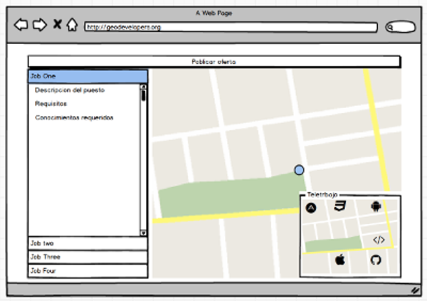
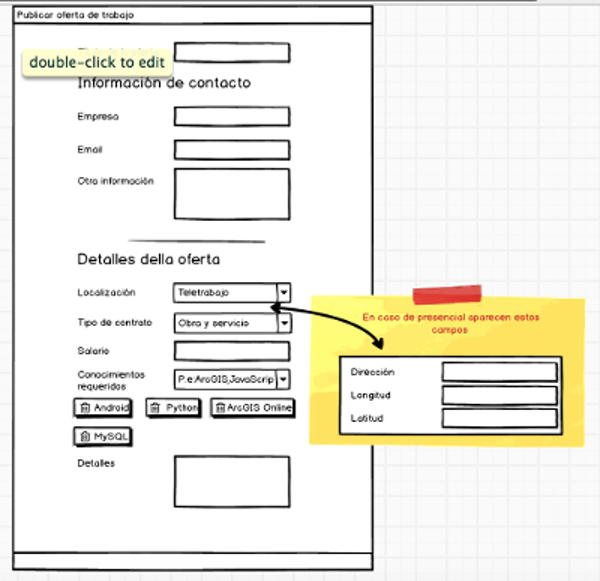

<!-- .slide: class="questions" -->

## How to: Geo-Developers Jobs site

[www.geodevelopers.org/jobs/](http://www.geodevelopers.org/jobs/)

Slides : [bit.ly/geo-dev-jobs](http://bit.ly/geo-dev-jobs)

___

<div>
    <p>Carlos Pérez Jimeno</p>
    <p>
    <br>
        <a href="https://github.com/jimeno0"><i class="fa fa-github" title="GitHub"></i>/jimeno0</a> |
        <a href="https://twitter.com/jimeno0"><i class="fa fa-twitter" title="Twitter"></i>/@jimeno0</a> | 
        <a href="https://www.linkedin.com/in/carlos-perez-jimeno-087b3390"><i class="fa fa-linkedin" title="linkedin"></i>/Carlos Pérez Jimeno</a> | 
        <a href="mailto:carlospj@icloud.com"><i class="fa fa-envelope" title="linkedin"></i>/carlospj@icloud.com</a>
    </p>
</div>

---

<!-- .slide: class="section" -->

##Goals

* Introduce the Geo-Developers jobs site
* Show how code works
* Get code and usability feedback 


---

<!-- .slide: class="section" -->

## Site introduction
[](http://www.geodevelopers.org/jobs/)

---

<!-- .slide: class="section" -->

## Getting started with mocks




--




---

<!-- .slide: class="section" -->

##Creating webMaps 

* Getting use to API 4.0

```javascript
var map = new Map({
  basemap: "streets-night-vector"
});

var simpsonsMap = new WebMap({
  portalItem: {
    id: "9ac664557a774a858adee0edbb4f686c"
  }
});

var worldView = createView ("viewDiv",map,5,[-3, 40],["zoom","attribution"]);
```

--

##Working with functions
  * Better style
  * More efficiency

```javascript

function createView(viewId,mapToSet,zoomToApply,centerToSet,uiArray){
  return new MapView({
  container: viewId,  
  map: mapToSet,
  zoom: zoomToApply, 
  center: centerToSet,
  ui: {
    components: uiArray 
    }
  });
}

function createSymbol (url){
...
}

```

--


##Clean code

```javascript
var worldView = createView ("viewDiv",map,5,[-3, 40],["zoom","attribution"]);
var simpsonsView = createView ("miniViewDiv",simpsonsMap,6,0,["attribution"]);
var companyLocatView = createView ("viewLocDiv",companyLocatMap,5,[-3, 40]);
```

---

<!-- .slide: class="section" -->

##Remote job offers

* Placed in a simpsons map by [Paula Rodrigo](https://www.linkedin.com/in/paula-rodrigo-garcia-a39b5355?authType=NAME_SEARCH&authToken=Mh2I&locale=es_ES&trk=tyah&trkInfo=clickedVertical%3Amynetwork%2CclickedEntityId%3A196936461%2CauthType%3ANAME_SEARCH%2Cidx%3A1-1-1%2CtarId%3A1469692860599%2Ctas%3APaula) & [PlayGIS](https://www.linkedin.com/company/2842760?trk=prof-exp-company-name)
* WebMap annotations cannot be drawed yet wit the API 4.0


--

##Solution

* Open the Chrome inspector
* Go to the network tab
* Serach the POIs request
* Export locations data to a json

--

##Working with requests

DDBB & SimpsonsPOIs

```javascript

window.GEODEV.jobs = {};
$.getJSON("/assets/data/simpsonsPOIs.json", function(datos){
  GEODEV.jobs.simpsonsAllPOIs = datos.POIS;
  GEODEV.jobs.simpsonsPOIs = [];
  getRandomSimpsPOIs(datos.POIS);
});

$.getJSON("/api/jobs?callback=?", function(datos){
  GEODEV.jobs.data = datos;
  getRandomSimpsPOIs();

  ....

});

```

--

##Getting random Simpsons POIs locations

from a json to locate remote offers

```javascript

function getRandomSimpsPOIs() {
  if (GEODEV.jobs.data && GEODEV.jobs.simpsonsAllPOIs){
    var count = 0;
    for (i = 0; i < GEODEV.jobs.data.length; i++) {
      if (GEODEV.jobs.data[i].on_remote === "yes") {
        var POIIndex = Math.floor(Math.random() * (54-count));
        GEODEV.jobs.simpsonsPOIs[count] = GEODEV.jobs.simpsonsAllPOIs[POIIndex];
        GEODEV.jobs.simpsonsAllPOIs.splice(POIIndex,1);
        count++;
      }
    }
    checkViewsThenDraw();
  }
}

```

--

##Check that the views are ready

```javascript
function checkViewsThenDraw () {
  worldView.then(function(){  
    drawPoints();
  }, function(error){
    console.log("Imposible cargar el mapa:" + error);
  });
  simpsonsView.then(function(){   
    drawPoints();
  }, function(error){
    console.log("Imposible cargar el mapa:" + error);
  });
}
```

--

##Then draw the locations on the map

```javascript
function drawPoints(){
  if ( worldView.ready && simpsonsView.ready) {
    var count = 0;
    for (i = 0; i < GEODEV.jobs.data.length; i++) {
      var jobID = GEODEV.jobs.data[i].id;
      ...

      var pointGraphic = new Graphic({
          attributes: {
            "id": jobID,
            ...
          }
        });

      var point = new Point();

      if (GEODEV.jobs.data[i].on_remote === "yes") {

        var POICoordX = GEODEV.jobs.simpsonsPOIs[count].geometry.x; 
        var POICoordY = GEODEV.jobs.simpsonsPOIs[count].geometry.y;
        var POIname = GEODEV.jobs.simpsonsPOIs[count].attributes.Name;
        count++;
        point.longitude = POICoordX;
        point.latitude = POICoordY;

        pointGraphic.geometry = point;
        pointGraphic.symbol = symbolSips;
        pointGraphic.attributes.location = POIname;

        if (simpsonsView.container.id === "viewDiv") {
          pointGraphic.popupTemplate = template;  
        }
        simpsonsView.graphics.add(pointGraphic);  
      }else {
        var lat = GEODEV.jobs.data[i].location_lat;
        var long = GEODEV.jobs.data[i].location_lon;

        point.longitude = long;
        point.latitude = lat;

        pointGraphic.geometry = point;
        pointGraphic.symbol = symbol;

        if (worldView.container.id === "viewDiv") {
          pointGraphic.popupTemplate = template;  
        }
        worldView.graphics.add(pointGraphic);
      }
    }
  } 
}
```

---

<!-- .slide: class="section" -->

##Change between views

```javascript
var chngViewBtn = dom.byId('chngViewBtn');
on(chngViewBtn, "click",changeViews);

function changeViews(callback){
  if (miniViewDiv.getAttribute("simpsons-in-main-view") === "0") {
    worldView = createView ("miniViewDiv",map,6,[-3, 40],["attribution"]);
    simpsonsView = createView ("viewDiv",simpsonsMap,6,0,["zoom","attribution"]);
    checkViewsThenDraw();
    miniViewDiv.setAttribute("simpsons-in-main-view","1");

  }else{
    worldView = createView ("viewDiv",map,6,[-3, 40],["zoom","attribution"]);
    simpsonsView = createView ("miniViewDiv",simpsonsMap,6,0,["attribution"]);
    checkViewsThenDraw();
    miniViewDiv.setAttribute("simpsons-in-main-view","0");
  } 
}
```

---

<!-- .slide: class="section" -->

##Job offers bootstrap accordion

* Use [jsrender](https://www.jsviews.com/)
  * `template`
  * Content
  * target

```javascript
var template = $.templates("#theTmpl");
var htmlOutput = template.render(GEODEV.jobs.data);
$("#accordion").html(htmlOutput);

```

--

##Template

* `html` template inside a `<script id="theTmpl" type="text/x-jsrender">`
* Calling objet properties to renderize with `{{:title}}`

```html
<div>
  <div class="panel panel-default">
    <div id="heading-{{:id}}" class="panel-heading" role="tab" >
      <h4 class="panel-title">
        <a id="link2Collapse-{{:id}}"  data-toggle="collapse" data-parent="#accordion"  href="#collapse-{{:id}}" aria-expanded="true" aria-controls="collapseOne">
          <h4>{{:title}}</h4>
        </a>
      </h4>
    </div>
    <div id="collapse-{{:id}}" job-id="{{:id}}" class="panel-collapse collapse" role="tabpanel" aria-labelledby="headingOne">
      <h5 class="text-primary" >Información de contacto</h5>
      <span class="text-primary">Empresa: </span>
      {{:company_name}}
      <br>
          <!--   ......   -->
    </div>
  </div>
</div>

```

--

##Content

* `json` response of the `Ajax` request to the BBDD

```javascript
GEODEV.jobs.data = datos;

```

--

##target

```javascript
$("#accordion").html(htmlOutput);
```

```html
<!-- JOBS ACCORDION -->
<div id="jobsDiv" class="col-md-4" >
  <div id="accordion" role="tablist" aria-multiselectable="true" ></div>
</div>
```

---

<!-- .slide: class="section" -->

##GoTo & highlight selected
On select any accordion element:
* Hide previous accordion showed
* Find selected element id on the map
* Then redraw this element with a highlighted symbol and go to this location

```javascript

$('.collapse').on('show.bs.collapse', function (e) {

  worldView.graphics.removeAll();
  simpsonsView.graphics.removeAll();
  drawPoints();

  $(GEODEV.jobs.prevJobShow).collapse('hide');

  var idJob = parseInt(e.target.getAttribute("job-id"));
  var simpsonsViewGraphic = simpsonsView.graphics.items;
  var worldViewGraphic = worldView.graphics.items;

  var isInWorldView = worldViewGraphic.find(isInView);
  var isInSimpsonsView = simpsonsViewGraphic.find(isInView);
  function isInView (lyr){
    return lyr.attributes.id=== idJob;
  }

  if (isInWorldView) {
    isInWorldView.symbol = highlightedSymbol;
    worldView.goTo({
        target: isInWorldView.geometry,
        zoom: 8
      },
      {
        animate: true,
        duration: 1000,
        easing: "ease-in-out"
    });

  } else {
    isInSimpsonsView.symbol = highlightedSymbolSimps;
    simpsonsView.goTo({
        target: isInSimpsonsView.geometry
      },
      {
        animate: true,
        duration: 1000,
        easing: "ease-in-out"
    });
  }

  //Getting the element to collapse when another accordion is been opened
  var prevJobShow = $("#" + e.target.getAttribute("id"));
  GEODEV.jobs.prevJobShow = prevJobShow[0];

});


```

---

<!-- .slide: class="section" -->

#Form

* Objetive
  * Create a form where companies can create their own offers 
* First attemp: Modal
  * If you scroll  you cant draw points correctly
* Solution: Create a form directly in the main page with a display toggle button 

---

<!-- .slide: class="section" -->

##Show/hide form

```html
<button type="button" class="btn btn-primary btn-block toggle" 
 href="#form" id="createJobBtn">Crear oferta</button>
```

```javascript

$('.toggle').click(function(){
  var target = $(this).attr('href');
  $(target).toggle(500);
  $(target)[0].reset();
});

```

---

<!-- .slide: class="section" -->

##Autocomplete [typeahead + bloodhound](https://twitter.github.io/typeahead.js/examples/)

* Bloodhound

```javascript
var companies = new Bloodhound({
  datumTokenizer: function(datum) {
    return Bloodhound.tokenizers.whitespace(datum.value);
  },
  queryTokenizer: Bloodhound.tokenizers.whitespace,
  remote: {
    url: 'https://autocomplete.clearbit.com/v1/companies/suggest?query=%QUERY',
    filter: function(companies) {
      // Map the remote source JSON array to a JavaScript object array
      return $.map(companies, function(company) {
        return {
          value: company.name
        };
      });
    }
  }
});
```

--

* Initialize the Bloodhound suggestion engine
* Instantiate the Typeahead UI

```javascript
companies.initialize();

$('.typeahead').typeahead(null, {
  displayKey: 'value',
  source: companies.ttAdapter()
});
```

---

<!-- .slide: class="section" -->

##Search widget

* create search widget
* Change widget icon
* start widget
* On start serach clear graphics and get the address
* add widget to the UI

--


```javascript
var searchWidget = new Search({
  view: companyLocatView
});

searchWidget.sources.items[0].resultSymbol = highlightedSymbol;

searchWidget.startup();

searchWidget.viewModel.on("search-start", function(evt){
  companyLocatView.graphics.removeAll();
  evt.target.popupOpenOnSelect = false;
  GEODEV.jobs.address = evt.target.currentSuggestion.text;
});

companyLocatView.ui.add(searchWidget, {
  position: "top-right"
});

```

---

<!-- .slide: class="section" -->

##Draw graphics

```javascript

companyLocatView.on("click", function(evt){
  if (companyLocatView.graphics.items[0]) {
    companyLocatView.graphics.removeAll();
  }else {
  }
  companyLocatView.graphics.add(createGraphic(evt.mapPoint));
});
```

---

<!-- .slide: class="section" -->

##show/hide form map

```javascript
$('#selOnRemote').on('change', function() {
  if ($('#selOnRemote').val() === 'yes') {
    $("#inputAddressDiv").hide();
  } else {
    $("#inputAddressDiv").show();
  }       
});
```

---

<!-- .slide: class="section" -->

##Submit form

* `required` inputs tag only works with `form.submit()`
* Prevent default: Do not close the window neigther print the json response 
* Check job type (if is on remote)
* Check if location is settled
  * Fill hidden lat/lon inputs
* Check if address is settled
* Send and close form

--

##Prevent defaults

* Prevent default `submit()` behavoir
* Both `preventDefault()` and set `return false` works

```javascript

$form.submit(function(event){
  event.preventDefault();

  ...

  return false;
});         
```

--

##Check if location is settled

```javascript

if (GEODEV.jobs.companyLocatView.graphics.items[0]) {
  var location = GEODEV.jobs.companyLocatView.graphics.items[0].geometry; 
}else{  
  return $("#warningMsng").html("Introduce una localización");
}

```

--

##Check if address is settled

```javascript
if (address) {
  $('#inputAddress').val(address);
  submitFormAndClose();
}else{
  console.log("hay que hacer reverse geocoder");
  var lat = location.latitude.toString();
  var long = location.longitude.toString();
  var urlGeoCoder = "http://geocode.arcgis.com/arcgis/rest/services/World/GeocodeServer/reverseGeocode?f=pjson&location="+long+","+lat;
  $.getJSON(urlGeoCoder, function(data){
    if (data.address) {
      $('#inputAddress').val(data.address.Match_addr);
    }else{
      $('#inputAddress').val(long+","+lat);
    }
    submitFormAndClose();
  });
}
```

--

##Submit and close

* Compile form and send: `.serialize()`
* End ponit at `form.action` attribute
* To hide the form `.toggle()`

```javascript

function submitFormAndClose(){
  $.post($form.attr('action'), $form.serialize(), function(response){
    console.log(response);
    $form.toggle(500);
  },'json');
}
```


---

<!-- .slide: class="questions centered" -->


## Questions?

Contact info

<div>
    <p>
        <a href="https://github.com/jimeno0"><i class="fa fa-github" title="GitHub"></i>/jimeno0</a><br />
        <a href="https://twitter.com/jimeno0"><i class="fa fa-twitter" title="Twitter"></i>/@jimeno0</a><br />
        <a href="https://www.linkedin.com/in/carlos-perez-jimeno-087b3390"><i class="fa fa-linkedin" title="linkedin"></i>/Carlos Pérez Jimeno</a><br />
        <a href="mailto:carlospj@icloud.com"><i class="fa fa-envelope" title="linkedin"></i>/carlospj@icloud.com</a>
    </p>
</div>


---


<!-- .slide: class="end" -->
